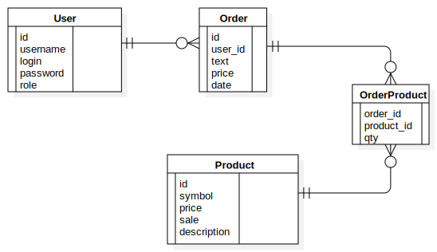

# ABstore - Alphabet Store Website

Website that finally allows people to write down all their thoughts, providing all the necessary letters at affordable prices! 

Functionality:
- buing letters;
- placement of the word on the main page;

## Use-Case Diagram 

## ER-Diagram

## ApacheBenchmark report

Server Software:        nginx/1.22.1
Server Hostname:        localhost
Server Port:            80

Document Path:          /api/v1/products
Document Length:        6573 bytes

Concurrency Level:      100
Time taken for tests:   46.110 seconds
Complete requests:      10000
Failed requests:        2535
   (Connect: 0, Receive: 0, Length: 2535, Exceptions: 0)
Non-2xx responses:      2535
Keep-Alive requests:    0
Total transferred:      65295226 bytes
HTML transferred:       63822271 bytes
Requests per second:    216.87 [#/sec] (mean)
Time per request:       461.100 [ms] (mean)
Time per request:       4.611 [ms] (mean, across all concurrent requests)
Transfer rate:          1382.89 [Kbytes/sec] received

Connection Times (ms)
              min  mean[+/-sd] median   max
Connect:        0    0   0.3      1       6
Processing:     5  434 409.1    342    2091
Waiting:        5  432 408.9    340    2087
Total:          5  435 409.1    343    2092
ERROR: The median and mean for the initial connection time are more than twice the standard
       deviation apart. These results are NOT reliable.

Percentage of the requests served within a certain time (ms)
  50%    343
  66%    583
  75%    723
  80%    811
  90%   1040
  95%   1211
  98%   1367
  99%   1479
 100%   2092 (longest request)
